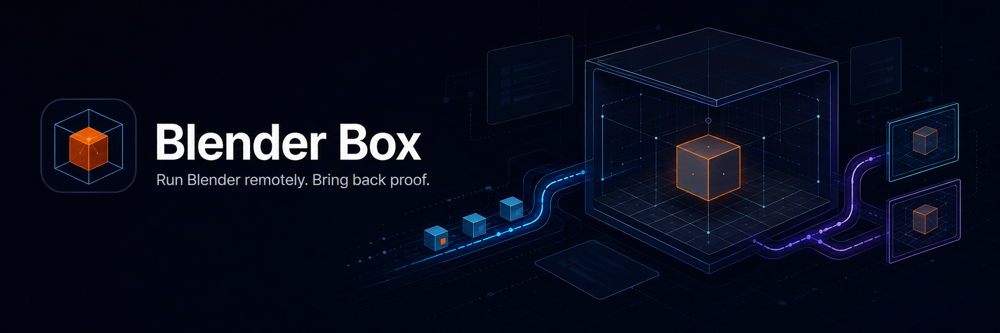

# Blender Box



Run declared Blender Scenarios on an owned Windows desktop from a developer checkout.

Blender Box sends a bounded Run Payload over SSH and starts Blender through a fixed interactive Scheduled Task. A host-local [`blendersessiond`](https://github.com/BramVR/blendersessiond) owns the Blender process. The client returns a verified Evidence Bundle, then cleans up the exact Session that it started.

Tailscale can provide private reachability, but Blender Box connects through a configured SSH alias. Blender's MCP add-on stays bound to Windows loopback.

## Project status

The first end-to-end slice supports read-only host checks, explicit setup, local planning, capture-aware host diagnosis, remote Scenario runs, reconnect status, exact stop, and local Evidence Bundles. A Scenario can request distinct viewport, Blender-window, and opt-in Windows-desktop captures.

The default test suite replaces SSH, the Scheduled Task, `blendersessiond`, the filesystem, and Blender with fakes. Proof against a real Windows Blender host is opt-in.

## Requirements

You need:

- Go 1.23 or later on the developer machine.
- An owned Windows host with OpenSSH and an interactive user who is logged in.
- A safe alias for that host in your SSH config.
- An existing work root, Blender installation, and compatible `blendersessiond` installation on Windows.
- One Windows identity for both SSH control and the interactive Scheduled Task. The account names may differ, but they must resolve to the same SID.

Blender Box does not install Blender or `blendersessiond`. It also does not change SSH, Tailscale, or firewall settings.

## Create a target profile

Create `target.json` with the non-secret settings for your host:

```json
{
  "schema_version": 1,
  "ssh_alias": "owned-windows-host",
  "ssh_user": "HOST\\operator",
  "work_root": "C:\\BlenderBox",
  "interactive_user": "HOST\\operator",
  "task_name": "BlenderBoxHost",
  "blender_executable": "C:\\Program Files\\Blender Foundation\\Blender\\blender.exe",
  "session_broker_executable": "C:\\BlenderBox\\bin\\blendersessiond.exe",
  "host_executable": "C:\\BlenderBox\\bin\\blender-box.exe"
}
```

Keep credentials, hostnames, IP addresses, and private network details out of this file. `ssh_alias` selects an entry from your SSH config.

Both `session_broker_executable` and `host_executable` must be inside `work_root` and below a dedicated executable directory. Blender may be installed elsewhere. The work root must be an ASCII drive path without spaces because setup supports legacy SCP.

## Set up the Windows host

Build the Windows host binary:

```sh
GOOS=windows GOARCH=amd64 go build -o /tmp/blender-box.exe ./cmd/blender-box
```

Inspect the setup plan. Plan mode validates the target profile and makes no SSH connection.

```sh
go run ./cmd/blender-box windows setup \
	--target target.json \
	--host-binary /tmp/blender-box.exe \
	--json
```

Apply the plan only to the owned host that you verified:

```sh
go run ./cmd/blender-box windows setup \
	--target target.json \
	--host-binary /tmp/blender-box.exe \
	--apply \
	--json
```

Setup publishes the hashed host binary, applies the required ACLs, checks the `blendersessiond` contract, and registers the Scheduled Task. The apply program runs inside the daemon's fenced Windows setup owner: every launch, status read, and stop carries a random Setup Attempt ID, Launch ID, and request hash, and success requires proof that the owned process tree is gone. It refuses an active Host Lock and rejects reparse points or untrusted write authority in managed paths.

## Check the installed host

Run the read-only host check after setup or when the host configuration changes:

```sh
go run ./cmd/blender-box windows check --target target.json --json
```

The check verifies the Windows identities, managed paths, ACLs, executables, operation locks, setup-owner state tree, Scheduled Task, and `blendersessiond` capabilities. A failed requirement returns `status: "fail"` without launching Blender.

## Create a Run Payload

A Run Payload lists the files to stage, the Python Scenario entry point, the daemon read timeout, and its capture policy. Each `source` path is relative to the payload document. Each `destination` path is relative to the remote payload root.

Create `payload.json` next to `scenario.py`:

```json
{
  "schema_version": 2,
  "files": [
    {
      "source": "scenario.py",
      "destination": "scenario.py"
    }
  ],
  "scenario": {
    "script": "scenario.py",
    "read_timeout_seconds": 600,
    "capture_viewport": true,
    "capture_blender_window": true,
    "capture_desktop": false
  }
}
```

The Scenario call must return one JSON document with `schema_version: 1` and `status: "pass"`. Payload schema 1 remains valid for the existing viewport-only contract. Blender-window and desktop captures require payload schema 2.

- `capture_viewport` records scene pixels through the daemon's offscreen or window-grab path.
- `capture_blender_window` records the full Blender window, including its UI chrome, through `bpy.ops.screen.screenshot` on the exact Session.
- `capture_desktop` records the Windows virtual desktop. It is always off by default and can contain unrelated private information.

A successful Run requires exactly one file for each requested capture. Missing, duplicate, malformed, or unsolicited evidence fails the Run.

Validate locally without contacting the host, then inspect the installed host capabilities:

```sh
go run ./cmd/blender-box plan --target target.json --payload payload.json --json
go run ./cmd/blender-box doctor --target target.json --payload payload.json --json
```

`doctor` is read-only. It checks the target and payload, runs the installed host inspection, and reports support for every requested capture before staging or launching Blender. Schema 1 viewport-only Payloads retain the existing host inspection path. Every schema 2 Payload requires the matching upgraded host binary.

## Run the Scenario

Start the Run from the developer checkout:

```sh
go run ./cmd/blender-box run \
	--target target.json \
	--payload payload.json \
	--timeout 20m \
	--json
```

`run` writes `RUN_ID=bbx_...` to stderr before validation or remote work. With `--json`, stdout contains one versioned success or failure result.

The client acquires the Host Lock, stages and verifies the Run Payload, starts the fixed Scheduled Task, and records the exact `blendersessiond` Session identity. It fetches and verifies evidence before it stops that Session and removes the remote Run files.

## Recover or stop a Run

If the client disconnects, use the Run ID to read the durable host receipt:

```sh
go run ./cmd/blender-box status \
	--target target.json \
	--run bbx_... \
	--json
```

Stop an active Run with the same Run ID:

```sh
go run ./cmd/blender-box stop \
	--target target.json \
	--run bbx_... \
	--json
```

`stop` recovers the recorded request and Session identities from host state. It never stops Blender by process name, port, executable path, or a guessed PID.

## Evidence Bundle

By default, each Run reserves `artifacts/blender-box/<run-id>/` before it contacts the host. Pass `--evidence-dir` to choose another new directory.

A successful Evidence Bundle contains:

- `manifest.json` with evidence paths, types, sizes, SHA-256 hashes, and capture provenance.
- `evidence.json` with the Run identity, request identity, deadline, Session identity, terminal state, and cleanup result.
- `result/scenario-result.json` with the Scenario Result.
- `screenshots/viewport.png` when the Run requests a viewport capture.
- `screenshots/blender-window.png` when the Run requests a Blender-window capture.
- `screenshots/desktop.png` only when the Run explicitly requests a desktop capture.

Schema 2 manifest entries record the capture type, method, dimensions, media type, byte size, SHA-256, source path, and exact Session identity. The client verifies hashes and PNG dimensions after transfer and never replaces an existing evidence file. Keep desktop Evidence Bundles private unless you have reviewed the image.

## Ownership boundaries

- `blender-box` owns SSH, host checks, setup, Host Locks, payload transfer, Scenario orchestration, evidence verification, and cleanup.
- `blendersessiond` owns Blender discovery, launch, health checks, MCP calls, and exact process-tree stop on Windows.
- Consuming repositories own Blender scripts, add-ons, scenes, expected outputs, and domain assertions.

SSH is the control and file-transfer channel. Blender Box never exposes or forwards Blender's loopback MCP port.

## Development

Run the same repository gate that GitHub Actions uses:

```sh
./scripts/ci all
```

The gate runs on Linux, macOS, and Windows without contacting a Blender host. See [CI architecture](docs/architecture/ci.md) for the hosted and live-proof boundary.

## Design documents

- [Run boundary](docs/architecture/0001-slice-0-run-boundary.md) defines orchestration, recovery, evidence, and cleanup.
- [Windows identity boundary](docs/architecture/0002-slice-0-windows-identity.md) explains why the current slice uses one Windows SID.
- [`blendersessiond` capability gate](docs/architecture/0003-session-broker-capability-gate.md) defines the daemon contract required before launch.
- [Research brief](docs/research/blender-box-research.html) records the broader product research and proposed contracts.
